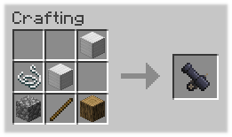
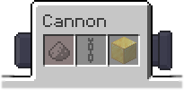

Fast travel? How about...
# Blast Travel
### Get from point A to B quickly and in style with cannons!

  
Made for **ModFest: Singularity** (1.19) for the **Quilt Mod Loader**
- Not planned to be ported to other loaders or versions (newer or older)

### Getting Started
**Craft the cannon:**  

  

**Prepare the cannon:**    

- Sneak + interact with (shift-right-click on) the cannon to open its UI
- Add gunpowder to the first slot (more will fire farther and faster)
- Add chains to the second slot to *lock the cannon*
- Add a decoration block (gold, moss) to the third slot, or optionally add alternative ammunition (tnt, anvils)
  

**Fire the cannon:**  

- Enter the cannon by interacting with (right-clicking on) it
- If the cannon is not chained, look around to aim the cannon
- Jump (press space) while inside the cannon to fire
- If you would like to fire something else (alternative ammunition, or another player), power the cannon with redstone
